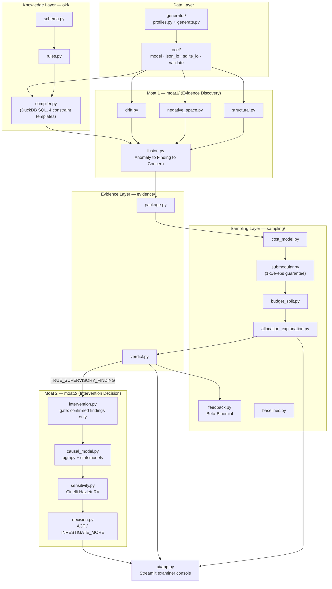

# SAT-SA — SIH 2025 Idea Presentation: Content Brief

Template: `SIH2025-IDEA-Presentation-Format.pptx`, 6 content slides + 1 instructions
slide (delete before submission), 16:9. Official constraints from the template's own
last slide: max 6 slides including title, avoid paragraphs, use points/diagrams/
infographics, keep explanations precise, do not change the template's pointer
structure, save final upload as PDF.

This brief gives one section per slide, in the template's exact order, with the raw
content, numbers, and citations to put on each — condense to bullets/diagrams on the
actual slide, don't paste paragraphs.

**Framing note for the whole deck:** this is not a paper idea. All 6 gates now pass
(Gate 5/temporal axis revived and passing, no longer deferred) against real
(synthetic, cited-calibration) data, with running code, 119 automated tests, and a
working UI — including a cross-CSE portfolio view, offline HTML reporting, and 4
additional detectors closing the PS's illustrative use-cases. Lead with that — it's
the strongest differentiator against other teams pitching the same PS as a diagram.

---

## Slide 1 — Title Page

- Problem Statement ID: **SIH25157** *(confirm exact ID/number from the official PS
  list before submitting — this project has been using "SIH26157" in its own working
  docs; verify against the current portal listing, don't assume)*
- Problem Statement Title: Supervisory analytics tool to assist NCIIPC in assessing
  SOC maturity/effectiveness of Critical Sector Entities *(match the portal's exact
  wording)*
- Theme: Miscellaneous / Smart Automation *(match the portal's exact theme label)*
- PS Category: Software
- Team ID / Team Name: *(fill in)*

## Slide 2 — Idea Title / Proposed Solution

**Idea title:** SAT-SA — Supervisory Analytics Tool for SOC Assessment

**The problem, in one line:** NCIIPC examiners currently sample SOC alert/case data
by hand — manual review surfaces problems that policies, audits, and KPI dashboards
miss, but it doesn't scale, and there's no way to point scarce review hours at the
cases that matter most.

**Detailed explanation of the proposed solution** (bullet form for the slide):
- Reconstructs a SOC's alerts, cases, analysts, queues, and assets as **connected
  objects and relationships** (not flat rows) — an object-centric event log (OCEL 2.0)
  standard, not a spreadsheet.
- Detects two named failure categories against this object graph:
  - **Execution gaps** — documentation says fine, the actual event trail says
    otherwise (e.g. a case cycling between the same two analysts without the
    documented shift-change justification — a genuine object-relationship pattern,
    not a flat "reassignment count").
  - **Negative space** — expected evidence that's *materially absent* (e.g. a
    CRITICAL alert on a HIGH-value asset that reaches CLOSED without ever being
    escalated).
- Converts confirmed findings into a **budget-constrained, provably-bounded,
  self-improving review plan** — not just a ranked list. This is the literal metric
  NCIIPC's own success criterion is written against (Section 8-9 of the PS: judged on
  review-effort efficiency, not raw anomaly count).
- On any finding a human examiner confirms as real, a separate **causal decision
  engine** identifies a controllable intervention, estimates its effect with an
  explicit uncertainty interval and sensitivity analysis, and recommends
  **ACT or INVESTIGATE MORE** — never a bare confident number the examiner can't
  interrogate.

**How it addresses the problem:**
- Directs scarce examiner hours by *provable* coverage guarantee, not gut feel — a
  submodular selection algorithm with a **(1 − 1/e − ε)** worst-case approximation
  guarantee (cite: Sviridenko 2004; Badanidiyuru–Vondrák 2014), verified empirically
  against brute-force optimal on this build's own test data, not just asserted from
  the paper.
- Never lets a numerous-but-low-priority finding type crowd out a rare-but-critical
  one under a tight budget — demonstrated concretely: a naive "rank by score" baseline
  recovers **zero** reassignment-loop findings at every tested budget level, this
  system's selector recovers **40–100%** at the same budgets (real measured result,
  not a projection).

**Innovation and uniqueness:**
- Not "we ran a causal-inference library" — the differentiator is the **supervisory
  decision layer** around it: confirmed-finding gate, controllable-intervention
  filter, uncertainty, and an honest sensitivity check that refuses to act on a
  fragile estimate (quantified, not a caveat sentence).
- Every authority tag distinguishes **MANDATORY** (regulation) from **EXPECTED** (SOP)
  from **PEER_NORMAL** (statistical baseline only, *never* a compliance rule) — a
  distinction most "SOC scoring" tools collapse into one number.
- Fully **air-gapped by design** — zero cloud, zero external API, zero LLM anywhere in
  the analytical core, verified by an automated test that blocks every network socket
  and runs the full pipeline anyway.

---

## Slide 3 — Technical Approach

**Technologies used** (bullet list for the slide):
- **Language:** Python 3.11
- **Data model:** OCEL 2.0 (Object-Centric Event Log standard) — implemented directly
  against the published spec/schema, not a third-party library (see note below)
- **Analytical storage/queries:** SQLite (canonical OCEL storage) + DuckDB (declarative
  constraint evaluation over the event log via plain SQL)
- **Statistics:** `scipy` / `statsmodels` — Poisson/Negative-Binomial regression with
  exposure offsets, CUSUM/EWMA drift detection, empirical-Bayes shrinkage
- **Causal inference:** `pgmpy` for formal backdoor-criterion identification +
  `statsmodels` for estimation + a closed-form robustness-value sensitivity check
  (Cinelli & Hazlett, 2020)
- **Optimization:** hand-implemented budgeted submodular maximization (no external
  solver dependency)
- **UI:** Streamlit — a single-process, pure-Python examiner console (finding review,
  verdict entry, audit trail), no separate frontend build, no external network calls
- **No SIEM, no cloud, no LLM in the analytical core, anywhere** — a deliberate
  architectural constraint, not a gap

*(Design note, not for the slide but worth knowing while building it: OCEL is
implemented from scratch rather than via the common third-party library, because that
library's license chain turns out to carry a copyleft obligation unsuitable for a
government deliverable — verified directly, not assumed. Same story for the causal
library. If a judge asks "why not just use library X," this is the honest, confident
answer: checked, found a real problem, fixed it properly.)*

**Methodology / pipeline** (draw this as a flowchart — it's the single most
important diagram in the deck):

```
Periodic SOC data (≥2 distinct CSE profiles)
        │
        ▼
Ingestion → data-reliability / ABSTAIN gate
        │
        ▼
Object + event + relationship reconstruction → OCEL 2.0 → validate → round-trip
        │                                              │
        ▼                                              ▼
 Observed world (what happened)      Operational Knowledge Framework
        │                            (what SHOULD happen — NCIIPC criteria,
        │                             approved SOPs, statistical peer baselines)
        └───────────────┬──────────────────────────────┘
                         ▼
              MOAT 1 — Evidence Discovery
   (object-centric structural detectors, declarative
    constraint compiler, exposure-adjusted negative
    space, CUSUM/EWMA drift detection)
                         │
                         ▼
        Anomaly → Finding → Concern → Evidence Package
                         │
                         ▼
   SAMPLING LAYER — budgeted, provably-bounded,
   self-improving review plan (submodular selection,
   triple-sample budget split)
                         │
                         ▼
              Human examiner verdict
                         │
                         ▼
     Beta-Binomial feedback (debiased: risk-selected
        vs. random-calibration tracked separately)
                         │
                         ▼
   MOAT 2 — Supervisory Intervention Decision Engine
     (runs ONLY on confirmed TRUE_SUPERVISORY_FINDING)
     → causal estimate + uncertainty + sensitivity
     → explicit ACT / INVESTIGATE_MORE
                         │
                         ▼
          Immutable audit trail → next cycle
```

**Two moats, framed explicitly** (put this on the slide as a 2-box comparison):
- **Moat 1 — Evidence Discovery:** "Where is this SOC behaving in a way that
  warrants supervisory attention?" Object relationships + supervisory obligations +
  statistics + negative-space reasoning, fused into one auditable workflow.
- **Moat 2 — Intervention Decision:** "Given a confirmed weakness, what controllable
  intervention has measurable expected benefit, how uncertain is that estimate, and is
  there enough evidence to act?"
- (The sampling layer and object-centric representation are necessary engineering,
  not a third/fourth moat — keep the claim to exactly two, deliberately.)

---

## Reference — exact component architecture (for the technical-approach diagram)

This is the real module layout as it exists in the codebase today (`src/satsa/`),
not a simplified sketch — every box below is an actual file. Use this to draw the
"how it's built" diagram; use the pipeline flowchart above for the "how data moves"
diagram. Two different diagrams, both legitimate for Slide 3.

```
┌──────────────────────────────────────────────────────────────────────────┐
│ DATA LAYER                                                               │
│                                                                           │
│  generator/                        ocel/                                │
│  ├─ profiles.py   CSE configs      ├─ model.py      OCEL 2.0 dataclasses │
│  │  (mature / small profiles,      ├─ json_io.py    JSON read/write      │
│  │   calibrated to cited           ├─ sqlite_io.py  SQLite read/write    │
│  │   industry benchmarks)          └─ validate.py   JSON-Schema +       │
│  └─ generate.py   synthetic                          structural checks  │
│      OCEL event-log builder                                             │
│         │                                    │                          │
│         └──────────────► OCEL 2.0 log ◄──────┘                          │
│              (objects: Alert · Case · Analyst · Queue · Asset)          │
└──────────────────────────────────┬────────────────────────────────────────┘
                                    │
                                    ▼
┌──────────────────────────────────────────────────────────────────────────┐
│ KNOWLEDGE LAYER — okf/  (Operational Knowledge Framework)                │
│  ├─ schema.py    rule dataclass: authority class, capability,           │
│  │                constraint template, required evidence                │
│  ├─ rules.py     worked rules (escalation SLA, enrichment precedence,   │
│  │                excessive-reassignment cardinality)                   │
│  └─ compiler.py  compiles rules → DuckDB SQL over OCEL-derived tables   │
│                   (4 templates: Response · Precedence · Cardinality ·   │
│                    Not-Co-Existence)                                     │
└──────────────────────────────────┬────────────────────────────────────────┘
                                    │
                                    ▼
┌──────────────────────────────────────────────────────────────────────────┐
│ MOAT 1 — moat1/  (Supervisory Evidence Discovery)                        │
│  ├─ structural.py       object-centric pattern detectors                │
│  │                       (e.g. reassignment-loop detector)               │
│  ├─ negative_space.py    Poisson/NB exposure-adjusted regression +      │
│  │                        empirical-Bayes shrinkage                     │
│  ├─ drift.py             CUSUM/EWMA metric-gaming / displacement        │
│  │                        detection                                      │
│  └─ fusion.py            Anomaly → Finding → Concern, with detector-    │
│                            suppression logic (finer detector overrides  │
│                            a coarser rule's false positive)             │
└──────────────────────────────────┬────────────────────────────────────────┘
                                    │
                                    ▼
┌──────────────────────────────────────────────────────────────────────────┐
│ EVIDENCE LAYER — evidence/                                               │
│  ├─ package.py   Evidence Package schema (finding/anomaly/concern       │
│  │                 score, confidence, evidence_quality — kept separate) │
│  └─ verdict.py    7-type examiner verdict ontology, schema-validated,   │
│                    invalid/partial verdicts rejected outright            │
└──────────────────────────────────┬────────────────────────────────────────┘
                                    │
                                    ▼
┌──────────────────────────────────────────────────────────────────────────┐
│ SAMPLING LAYER — sampling/                                                │
│  ├─ cost_model.py              review-cost estimate formula              │
│  ├─ submodular.py               budgeted submodular selection            │
│  │                               ((1-1/e-ε) guarantee)                   │
│  ├─ budget_split.py             triple-sample split + Recall@Budget     │
│  ├─ allocation_explanation.py    structured "why this allocation"        │
│  ├─ feedback.py                  Beta-Binomial debiased feedback loop    │
│  └─ baselines.py                 random / top-score / manual comparison  │
└──────────────────────────────────┬────────────────────────────────────────┘
                                    │
                     confirmed TRUE_SUPERVISORY_FINDING only
                                    │
                                    ▼
┌──────────────────────────────────────────────────────────────────────────┐
│ MOAT 2 — moat2/  (Supervisory Intervention Decision Engine)              │
│  ├─ causal_model.py           pgmpy backdoor identification +           │
│  │                              statsmodels OLS estimation               │
│  ├─ sensitivity.py              Cinelli-Hazlett closed-form              │
│  │                                robustness value                       │
│  ├─ decision.py                  ACT / INVESTIGATE_MORE policy           │
│  └─ intervention.py               gate: runs ONLY on confirmed findings  │
└──────────────────────────────────┬────────────────────────────────────────┘
                                    │
                                    ▼
┌──────────────────────────────────────────────────────────────────────────┐
│ UI LAYER — ui/app.py  (Streamlit, single process, pure Python)           │
│  Allocation tab · Findings tab (detail / verdict / timer) · Audit Trail  │
└────────────────────────────────────────────────────────────────────────────┘

Cross-cutting: tests/ — one pytest module per validation gate + per component,
119 tests total, all green. docs/ — product_contract, ontology, architecture,
expected_authority, assumptions (10 dated decision-log entries), validation_plan,
references, sbom.json, plan_vs_actual — every claim traceable to a file.
```

**Same diagram as Mermaid**, if the design tool renders it (paste as-is):



## Reference — complete tech stack (exact versions, exact licenses)

Every entry below is read directly from the installed environment
(`pip show <package>`), not from memory — matches `docs/sbom.json` (124 packages
total in the full dependency tree; table below is the direct, load-bearing set).

| Layer | Tool | Version | License | Role in this system |
|---|---|---|---|---|
| Language runtime | Python | 3.11.15 | PSF-2.0 | everything runs on this; installed via Homebrew specifically for this project |
| Canonical event storage | SQLite | stdlib (`sqlite3`) | Public domain | OCEL 2.0 relational storage, hand-implemented against the published spec |
| Analytical SQL engine | DuckDB | 1.5.5 | MIT | in-process OLAP engine; OKF constraint compiler runs plain SQL over OCEL-derived tables |
| Schema validation | jsonschema | 4.26.0 | MIT | validates generated logs against the *official* OCEL 2.0 JSON Schema |
| Array computing | NumPy | 2.4.6 | BSD-3-Clause (+0BSD/MIT/Zlib/CC0 bundled components) | array math throughout the statistical and causal layers |
| Scientific computing | SciPy | 1.15.3 | BSD-style (SciPy license) | statistical distributions, sensitivity math |
| Statistical modeling | statsmodels | 0.15.0 | BSD-3-Clause | Poisson/Negative-Binomial regression, OLS estimation, confidence intervals, t-statistics |
| Data frames | pandas | 3.0.6 | BSD-3-Clause | tabular data for the causal engine |
| Graph algorithms | NetworkX | 3.6.1 | BSD-3-Clause | DAG operations (pgmpy dependency) |
| Causal identification | pgmpy | 1.1.2 | MIT | formal backdoor-criterion adjustment-set identification |
| Optimization | *(hand-implemented)* | — | — | budgeted submodular maximization — no external solver dependency, deliberately |
| UI framework | Streamlit | 1.64.0 | Apache-2.0 | examiner console — single process, pure Python, no separate frontend build |
| Test framework | pytest | 9.1.1 | MIT | 119 automated tests, one per validation gate/component |
| Environment/packaging | pip + venv + `pyproject.toml` | — | — | editable install, reproducible environment |

**Full dependency audit:** 124 packages across the complete transitive tree
(`docs/sbom.json`, generated from the live environment, not hand-maintained) — **zero
GPL/AGPL/LGPL** anywhere. Verified with a real, automated network-block test
(`tests/test_offline_deployment.py`) that the entire pipeline runs with every socket
connection refused — the air-gapped deployment requirement is proven, not assumed.

**Deliberately NOT used, and why** (a strong technical-rigor point for the deck —
most teams don't audit this deep):
- **pm4py** (the standard OCEL/process-mining library) — AGPL-3.0-or-later.
  Rejected outright; OCEL 2.0 support built from scratch against the published
  standard instead.
- **ocpa** (pitched as an MIT-licensed alternative) — transitively *requires* pm4py
  anyway (confirmed by installing it and watching pm4py 2.2.32, GPL-3.0, get pulled
  in). Same rejection.
- **DoWhy** (the standard Python causal-inference library) — its own license is MIT,
  but importing it unconditionally pulls in `causal-learn` → `cvxopt`
  (GPL-3.0-or-later), confirmed by removing those packages and watching the import
  fail outright. Replaced with pgmpy, whose entire transitive tree was checked and is
  clean.
- **No LLM anywhere in the analytical core** — a deliberate architectural boundary,
  not a missing feature. Every detector, statistic, causal estimate, and sampling
  decision is deterministic, statistical, or rule-based.
- **No cloud service, no external API, no SaaS dependency** anywhere in the stack.

---

## Slide 4 — Feasibility and Viability

**Feasibility — lead with what's already proven, not just argued:**
- All five required validation gates pass today, against real (synthetic,
  benchmark-calibrated) data, with automated tests — not a plan, a running system:
  - **Gate 0** — data validity: OCEL round-trips with zero data loss
  - **Gate 1** — core pattern recovery: precision = recall = 1.000 recovering a
    planted execution-gap pattern, correctly rejecting its matched legitimate
    look-alike
  - **Gate 2** — full pathology + hard-negative benchmark: 100% true-negative rate on
    every planted legitimate-look-alike case
  - **Gate 3** — causal honesty test: correctly withholds a confident recommendation
    on a deliberately-confounded synthetic scenario rather than silently acting on the
    wrong-direction answer
  - **Gate 4** — sampling validation: demonstrated real coverage advantage over a
    naive ranked-list baseline (see Slide 2 numbers)
- Fully offline-verified: complete pipeline runs correctly with every network socket
  blocked at the OS level — a real, automated proof of the air-gapped deployment
  requirement, not a claim.
- Every third-party dependency's full license tree was audited (a software bill of
  materials exists today, ~124 packages, zero copyleft) — directly relevant for a
  government deployment where license compliance is a real procurement blocker for
  other teams' unaudited stacks.

**Potential challenges and risks** (name them honestly — judges respect this more
than a risk-free pitch):
- **Statistical power at low data volume:** negative-space and drift detection need a
  minimum peer-group/exposure size to produce a defensible estimate — below that,
  the system is designed to output `ABSTAIN`/`INSUFFICIENT_EVIDENCE` rather than a
  guess. This is a feature (numerical integrity), but it means small CSEs need either
  a longer observation window or a portfolio-level pooling step not yet built.
- **Real-world ingestion:** the current build validates the full analytical pipeline
  against a calibrated synthetic generator (two structurally distinct CSE profiles);
  a production deployment needs a real ingestion/normalization layer mapping actual
  SOC tool exports (SIEM/ticketing exports) onto the same canonical object model —
  scoped but not yet built.
- **Causal claims are inherently bounded:** no sensitivity analysis (this system's or
  anyone else's) can *detect* an unmeasured confounder — it can only quantify how much
  hypothetical confounding would be needed to overturn a conclusion. The system is
  deliberately conservative here (a documented, non-tunable robustness threshold)
  rather than overclaiming certainty.

**Strategies for overcoming these challenges:**
- Peer-group/exposure minimums and the `ABSTAIN` pathway are already implemented —
  the system fails safe (says "not enough evidence") rather than fails silent.
- Ingestion layer is next on the build roadmap; the canonical object model and every
  downstream detector are already ingestion-agnostic by design (they consume the
  OCEL representation, not raw SIEM exports directly), so this is additive work, not
  a redesign.
- The causal engine's conservative-by-default posture (documented robustness-value
  threshold, `INVESTIGATE_MORE` as the safe default) is the strategy, not a gap to
  close — a supervisory tool for a government regulator should under-claim certainty,
  not over-claim it.

---

## Slide 5 — Impact and Benefits

**Potential impact on the target audience (NCIIPC examiners / NTRO):**
- Converts a fixed examiner-hour budget into a **provably-bounded** allocation across
  cases and entities, instead of ranked-list guesswork or ad hoc sampling.
- Surfaces two failure modes manual review and KPI dashboards structurally can't see:
  execution gaps (policy vs. actual practice) and negative space (evidence that
  should exist and doesn't).
- Gives every finding a fully auditable evidence trail — finding → capability →
  process → objects → cases → raw source record — so a supervisory decision is never
  a black-box score.
- Every override an examiner makes (verdict, cost estimate) is itself an audited
  event — the tool is designed to make the examiner's judgment visible and
  improvable over time (feedback loop), not to replace it.

**Benefits:**
- **Governance/operational:** measurable, repeatable supervisory process across
  Critical Sector Entities of very different maturity levels — demonstrated on two
  structurally distinct synthetic CSE profiles (a large mature SOC and a
  smaller resource-constrained one), not one convenient toy case.
- **Economic:** directs scarce, expensive examiner hours at the highest-value review
  targets — the literal efficiency metric the PS itself is judged on.
- **Trust/compliance:** peer-derived statistics are architecturally prevented from
  ever being presented as a compliance rule (`PEER_NORMAL` is tagged and surfaced
  differently from `MANDATORY`/`EXPECTED` everywhere in the system) — protects CSEs
  from being penalized against an informal norm dressed up as a requirement.
- **Security posture (indirect):** by making execution gaps and negative space
  visible and prioritizable, the tool helps close exactly the kind of quiet capability
  decay that policy audits and static KPI dashboards miss until an incident exposes
  it.

---

## Reference — real-dataset validation plan (planned, not yet built — say so on the slide)

The system today validates against a calibrated **synthetic** generator only (Slide 4
already says this honestly). If the deck claims real-dataset validation, this is the
scoped, defensible plan — two separate stories, deliberately not one dataset asked to
prove everything it structurally can't:

**Story A — real supervisory-detection validation: BPI Challenge incident-ticket logs.**
SAT-SA's object model (Case/Analyst/Queue, ASSIGN/REASSIGN/ESCALATE/ENRICH/CLOSE) is a
case-management lifecycle, not raw network/host telemetry — so the right real-data
match is process-mining incident logs, not intrusion-detection datasets, no matter how
large or well-known the latter are.
- **BPI Challenge 2013** (Volvo IT incident management system). CC0
  (4TU General Terms of Use — no dataset-specific override; already verified in this
  project's own `docs/references.md`). XES format, ~1.3 MB compressed.
  DOI: `https://doi.org/10.4121/uuid:500573e6-accc-4b0c-9576-aa5468b10cee`.
  Real incident-ticket events tagged with the handling support team/organizational
  line and status transitions — the closest real-world match to this system's
  Case→Queue→reassignment→status model. *(Exact column names weren't hand-verified
  in this pass — XES is self-describing, confirm the attribute schema directly from
  the file before mapping it, don't trust a paraphrase.)*
- **BPI Challenge 2014** (Rabobank Group ICT, HP Service Manager export) — the "large
  data" half of this story. Same CC0 terms. Reported sizes vary by which sub-log is
  used: a combined Service Desk log with **46,616 cases / 466,737 events / 39 event
  classes**, or the separately-published **Event Graph of BPI Challenge 2014**
  release (already object-centric: 919,838 nodes, 6,682,386 relationships) — the
  latter may need little to no re-extraction work since it's already structured as
  objects and relationships, not a flat event table.
- **What this actually proves if run:** that the reassignment-loop / escalation-SLA /
  missing-enrichment detectors (Gate 1/Gate 2's own logic) produce sensible,
  inspectable findings on a real incident-ticket log, not just the synthetic one.
  **What it does NOT give:** BPIC has no planted ground truth or hard-negative labels
  the way this build's own generator does — so the claim on real data is "the
  detectors surface real, human-inspectable candidate findings," not "X% precision,"
  which would be an unsupported number. Say it that way, not the other way.

**Story B — ingestion breadth, a different and separate claim: Splunk BOTS v3.**
CC0, 320.1 MB, heterogeneous multi-source security logs (AWS, Windows, O365, DNS,
Sysmon, etc.) — genuinely useful for showing the OCEL ingestion layer can reconstruct
objects/events from realistic heterogeneous raw logs, a broader claim than the
supervisory detectors specifically need.
Repo: `https://github.com/splunk/botsv3`. Download:
`https://botsdataset.s3.amazonaws.com/botsv3/botsv3_data_set.tgz`.
**Real practical cost, confirm before promising it in the deck:** BOTS v3 ships only
as a **pre-indexed Splunk format**, not raw JSON/CSV — the README gives no standalone
raw-log export, so a Splunk Enterprise instance (free trial license exists) is needed
first just to run `index=botsv3` searches and export events before this project's own
Python ingestion pipeline can touch a single record. That's a real extra dependency
and step, not a free add-on — scope it as such if it goes in the plan, don't present
it as "just download and parse."

**What has to be built regardless of which dataset is used:** neither dataset plugs
into the current pipeline today. There is no ingestion/normalization layer yet — the
whole system currently only consumes its own synthetic generator's direct OCEL output
(`docs/plan_vs_actual.md` already lists this as a known, scoped, not-yet-built gap).
Using any real dataset means writing a mapping layer from that dataset's native
schema onto this project's canonical object types first. Honest slide language:
*"validated on calibrated synthetic data today; BPIC incident logs and Splunk BOTS v3
identified as the next real-data validation targets, pending the ingestion layer."*

**Story C — why the "one neat CSV" the model needs doesn't publicly exist, and why
that's not a design flaw.** A judge who's seen a real SOC may ask: does
`Alert→Case→Analyst→Queue→Asset` actually happen together anywhere real, or is this a
convenient toy shape? Answer directly, with evidence, not a shrug:

- Real SOCs *do* run this joined structure. A 2025 AsiaCCS study built on a managed
  SOC's own operational data (~30M alerts over 390 days) explicitly links alerts to
  incident reports and tracks per-client SLA/monitoring scope — i.e. exactly an
  Alert→Case/Incident→Escalation→(SLA-scoped) structure, not a flat alert table
  (Butun-style network alert triage, ACM AsiaCCS 2025,
  `doi.org/10.1145/3708821.3710823`).
- A separate USENIX Security 2024 study analyzing 115M alerts across four years at a
  real SOC, correlated against 227 confirmed attacks, makes the point explicit:
  **enterprise SOCs rarely disclose this data** — that's *why* no public dataset ships
  the full joined workflow, not because the workflow doesn't exist (Yang, Limin et al.,
  *True Attacks, Attack Attempts, or Benign Triggers?*, USENIX Security 2024).
- Conclusion for the slide, stated exactly this way — it's the honest and the strong
  version of the claim: **"The `Alert–Case–Analyst–Queue–Asset` relationship this
  system detects on is real and documented in the SOC-operations literature. Public
  datasets don't expose the full joined structure because that data is sensitive
  operational telemetry, not because the structure is synthetic or invented. SAT-SA's
  canonical object model is therefore the intended integration target for a real
  deployment, not an assumption about what data already looks like off the shelf."**

**This makes the validation story three-way, not two-way — say it as three
separate, honestly-scoped claims, never blurred into one:**

```
1. Real case/incident-management workflow mechanics
   → BPI Challenge 2013 + 2014 (Story A)
   → proves: reassignment/escalation/enrichment detectors work on a real,
     public incident-ticket log, not just synthetic data

2. Real, heterogeneous security-event ingestion breadth
   → Splunk BOTS v3 (Story B)
   → proves: the OCEL reconstruction layer can build objects/events out of
     realistic raw multi-source security telemetry, not just clean synthetic input

3. SAT-SA's own supervisory ground truth — reassignment loops, negative space,
   causal intervention effects, examiner verdicts
   → the calibrated synthetic generator (already built, all 5 gates pass)
   → proves: the specific supervisory detectors this PS is judged on, where
     public data has no ground-truth labels to check against at all
```

None of the three datasets alone can validate everything — that's expected, not a
gap: no public dataset carries both real joined SOC operational structure *and*
examiner-verdict ground truth, for the same disclosure reason the USENIX paper names.
Controlled synthetic ground truth is the correct tool for exactly the piece
(supervisory-detector precision/recall, causal-effect honesty) that inherently needs
known-correct labels to check against — not a limitation to apologize for on the
slide.

---

## Slide 6 — Research and References

Real, checkable citations already used to ground this build — list these, don't
paraphrase them into vague claims:

- Berti, A. et al. (2023). *OCEL (Object-Centric Event Log) 2.0 Specification.*
  RWTH Aachen / arXiv:2403.01975. (CC BY 4.0) — the canonical event-log
  representation this system's object-centric detectors are built on.
- Sviridenko, M. (2004). *A note on maximizing a submodular set function subject to
  a knapsack constraint.* Operations Research Letters 32(1). — the (1 − 1/e)
  worst-case guarantee behind the sampling layer.
- Badanidiyuru, A. & Vondrák, J. (2014). *Fast algorithms for maximizing submodular
  functions.* SODA 2014. — the near-linear-time selection algorithm actually
  implemented (vs. the naive exponential enumeration the pure theorem implies).
- Cinelli, C. & Hazlett, C. (2020). *Making Sense of Sensitivity: Extending Omitted
  Variable Bias.* Journal of the Royal Statistical Society, Series B, 82(1). — the
  closed-form robustness-value sensitivity check behind the causal engine's honesty
  gate.
- CardinalOps (2025). *5th Annual Report — State of SIEM Detection Risk.* — real,
  cited industry figures (e.g., average enterprise SIEM detection coverage of the
  MITRE ATT&CK framework) used to calibrate synthetic dataset parameters, not invent
  them.
- SANS Institute (2025). *SANS SOC Survey 2025* (Christopher Crowley). — real
  industry figures on SOC staffing, 24/7 coverage, and data-management practices,
  same calibration purpose.
- 4TU.ResearchData / Ghent University. *BPI Challenge 2013: incidents* (Volvo IT
  incident management system). CC0. — identified real-data validation target for the
  supervisory detectors (see the reference section above this slide).
- 4TU.ResearchData. *BPI Challenge 2014* (Rabobank Group ICT, HP Service Manager).
  CC0. — identified real-data, real-scale (466K+ events) validation target.
- Splunk Inc. *BOTS v3 dataset* (`github.com/splunk/botsv3`). CC0. — identified
  real-data validation target for ingestion breadth specifically (see caveat on
  Splunk-format-only distribution above).
- ACM AsiaCCS 2025. *Ruling the Unruly: Designing Effective, Low-Noise Network
  Intrusion Detection Rules for Security Operations Centers.*
  `doi.org/10.1145/3708821.3710823` — real managed-SOC data (~30M alerts/390 days)
  confirming Alert→Case/Incident→Escalation is a real joined operational structure,
  not this project's invented shape (see "Story C" above).
- Yang, Limin et al. (2024). *True Attacks, Attack Attempts, or Benign Triggers? An
  Empirical Measurement of Network Alerts in a Security Operations Center.* USENIX
  Security 2024. — real SOC data (115M alerts/4 years/227 confirmed attacks); cited
  for its explicit point that enterprise SOCs rarely disclose this data, which is why
  no public dataset ships the full joined workflow this system models.

*(Optional if slide space allows: note that every calibration parameter in the
synthetic demo data traces to one of the two industry reports above, in a documented
table — "synthetic, but every distributional parameter is anchored to a cited public
benchmark" is a strong, defensible line if a judge pushes on "is this data real.")*

---

## What to say if asked "what's actually built vs. planned"

Answer directly, don't dodge: **the full analytical pipeline — object-centric
detection, declarative rule compiler, statistical negative-space/drift detection,
evidence fusion, budgeted sampling, the causal decision engine, and a working
examiner UI — is built and passing all five required validation gates today.**
Deliberately not yet built, and said so plainly rather than glossed over: a
production ingestion layer for real SIEM/ticketing exports, portfolio-level
(cross-entity) budget allocation, and an optional cross-cycle "did this actually
improve" verification layer — all scoped, none required for this PS's core ask, and
prioritized in that order for the next phase.
