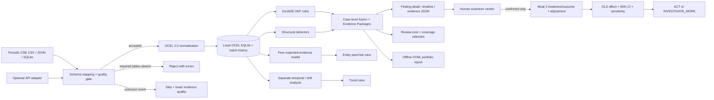

# SAT-SA presentation blueprint — six-page visual match to the supplied PDF

**Purpose.** This is a production specification for a **new SAT-SA slide deck/PDF**, not a text extraction of the reference. The visual reference is [`1790369431005.pdf`](/Users/abhinavmittal/Downloads/1790369431005.pdf): six 16:9 landscape pages, each **1440 × 810 pt**. Its subject is a different phishing product in a **Smart India Hackathon 2025** template. Preserve its page geometry, visual hierarchy, colours, badge/logo positions, tables, diagram density, illustrations and footer; replace every phishing claim with verified SAT-SA content. The actual SAT-SA code and the supplied NCIIPC problem statement are the factual sources.

**Snapshot:** 26 September 2026. Source-code paths below are relative to the repository root. “Implemented” means present in the code now; “demo” means synthetic examples; “validation pending” means it must not be advertised as proven on NCIIPC submissions. No application or backend change is specified by this document.

## How to reproduce the reference's appearance

1. Put a rendered reference page behind each new page at 50% opacity while laying out objects. Trace **positions, dimensions and line breaks** rather than recreating it from extracted text. Render at 2× or 3×, overlay the new page, and inspect for alignment before final export. Use a 1440 × 810 canvas or an exactly proportional 16:9 slide.
2. **Page 1:** white canvas; huge dark-navy, Times New Roman bold, all-capital SIH masthead across the top; SIH brain mark at top right; large pale-gray hexagonal brain/lightbulb watermark over the right half; left-aligned black bold bullet facts in the lower-left/middle. It has **no blue bottom strip**.
3. **Pages 2–6:** white canvas; small thin purple elliptical team badge at upper left; black bold uppercase section title centred at top; SIH logo upper right; saturated royal-blue horizontal footer spanning the full bottom edge, with centred small white template credit and page number at right. Reuse precisely the same master objects on all five pages. The supplied reference says `@SIH Idea submission- Template` in the footer. Keep that template credit only if the competition permits template reproduction; otherwise retain its location, size and colour with the required attribution text.
4. Reference typography: Times New Roman bold on page 1 masthead; Arimo/Poppins-like bold and regular sans on page body; Canva Sans/Arial-like small table text. Do not use a modern dashboard typography or alternate slide theme. Heading sizes are visually about 32–46 pt; body about 20–25 pt on pages 1–2 and 14–19 pt for crowded pages 3–6. Match the reference's actual line breaks by visual overlay. All text must remain readable in the rendered PDF.
5. The visual vocabulary is white, dark navy/black, blue headings/footer, pastel lavender solution bands, cyan/coral/pale-pink table cells, pink and cyan benefit panels, small red emphasis, thin black rules and arrows. Sample exact fills from the source PDF during slide construction; these are **visual sampling targets**, not invented institutional brand standards. Keep its intentionally dense, student-template quality: do not replace page 3 with a fashionable minimalist architecture illustration.
6. Replace the reference's unrelated phishing-themed illustration with an **original vector illustration in the same size and style**: central blue shield containing a document/evidence symbol and laptop, six surrounding circular icons for “Detect”, “Investigate”, “Escalate”, “Compare”, “Review”, “Audit”. Build with local vector shapes/icons embedded in the deck. Do not use a remote image at runtime. On page 5 use a real SAT-SA UI screenshot from the running offline app; crop into the same image footprint as the reference photo.
7. Use the official SIH logo and exact year/PS metadata from the **submission portal or organizer-provided template**. The example PDF is marked 2025, while the SAT-SA portal item previously observed was **SIH26157** under NTRO, “Blockchain & Cybersecurity”, Software. The publicly accessible page could not be independently re-opened during this review. Therefore set editable fields for year, PS ID, team ID/name and organization and verify these against the live submission form before exporting. Never carry over the phishing example's team name, PS number, screenshots, video link or source claims.

### Content density rule

The visible slide copy below is short enough to fit the six reference layouts. The **speaker-note / appendix details** under each page explain every mechanism for the presenter and can be used for a companion technical report; do not force the entire appendix into tiny slide text. Any numerical result in the visible deck must come from a saved run with dataset ID, date, denominator, method and code version.

---

## Slide 1 — submission cover, matching reference page 1

**Geometry.** Duplicate the reference's masthead, top-right SIH symbol, light-gray watermark shape and bullet-marker positions. Place the bullets in the left 60% of the page, with the project title wrapping over about two lines just as the example does. Use black bold sans for values. Do not add charts, cards, a footer or decorative colours.

**Visible copy, in the reference's bullet order** (replace brackets with portal-verified data):

- **PS ID:** `[VERIFY SIH 2026 PORTAL — previously observed SIH26157]`
- **PS Title:** `Supervisory Analytics Tool for SOC Assessment (SAT-SA)`
- **Theme:** `[VERIFY PORTAL — previously observed Blockchain & Cybersecurity]`
- **Category:** `Software [verify]`
- **Team ID:** `[actual submission ID]`
- **Team Name:** `[actual registered team name]`

**What the title means.** NCIIPC examines periodic SOC alerts and case-management records from multiple Critical Sector Entities (CSEs). SAT-SA flags **where an examiner should look**, explains the supporting records, and allocates limited review time. It does **not** operate a SOC, perform live monitoring, ingest continuous telemetry, or decide supervisory outcomes autonomously. This framing should be spoken or used in the presenter notes, not added as an extra visual block that breaks page 1.

**Source/asset links.** [Reference PDF](/Users/abhinavmittal/Downloads/1790369431005.pdf); [problem statement supplied by user](../docs/product_contract.md) (check against the exact submitted problem text); official SIH logo/team metadata from the organizer's submission portal, not extracted from the phishing deck.

## Slide 2 — idea and two moats, matching reference page 2

**Geometry.** Keep the badge/title/logo/footer master. Use the same blue left subheading at about x=55–75, y=135–165. Create **five long pale-lavender pill bands** stacked with equal gaps in the left ~60%, occupying approximately y=205–675. Put dark Poppins-style centred text in each, with 1–3 key phrases red. In the right ~35%, place the central blue shield/laptop illustration and six coloured icon satellites. Footer remains about 55–65 pt tall.

**Top title:** `SUPERVISORY ANALYTICS TOOL FOR SOC ASSESSMENT`

**Blue subheading:** `Proposed Solution (Describe your Idea/Solution/Prototype)`

**Five bands; slide-ready wording:**

1. `Periodic CSV, JSON and SQLite case submissions from multiple CSEs become a common object-centric event record.` Red: `multiple CSEs`.
2. `Moat 1 joins explicit operational rules with structural anomalies and negative-space peer baselines.` Red: `execution gaps + negative space`.
3. `Each flagged issue opens an explainable finding: exact case, events, rule, rationale, provenance and review cost.` Red: `explainable finding`.
4. `A budgeted review plan selects diverse evidence across capabilities instead of repeating the same easy cases.` Red: `diverse evidence`.
5. `Moat 2 asks whether a proposed intervention plausibly helps; uncertain estimates return to the human examiner.` Red: `human examiner`.

**Six icons around the central picture:** submitted file/tray (Ingest), linked nodes (Object model), magnifier (Detect), people/peer chart (Compare), checklist (Review), seal/document (Audit). Their labels should be as short as the reference's pictogram labels. Use [Python's logo](https://www.python.org/community/logos/) only on page 3, not as a claim of a proprietary model.

**Speaker-note details.** The core distinction is **Moat 1 = discover and prioritise supervisory concerns**; **Moat 2 = test a possible response to a confirmed concern with uncertainty and sensitivity checks**. Execution gaps are present actions that fail intent (for example a critical escalation missed, investigation omitted, rapid closure); negative space is evidence expected by a peer/exposure model but absent (for example little coverage on critical assets). An absent event is only suspicious relative to comparable exposure and data quality; it is not proof of misconduct. Findings are evidence prompts, with a human verdict workflow. For this prototype, the finding fusion is strongest at case level. Some entity-level negative-space and drift mechanisms are separate and should not be portrayed as one fully unified production pipeline.

**Visual asset specification.** Rebuild the reference's blue, flat security illustration with a SAT-SA evidence card on the laptop screen; avoid a screenshot of the phishing original. All six pictograms should be filled/outlined vector shapes with the same approximate size, offset and colour cadence as page 2.

## Slide 3 — real stack and exact architecture, matching reference page 3

**Geometry.** Keep the master. Place `Techstack Used:` in blue at the left edge under the header. Preserve the reference's **narrow left stack column (~23%)**, its thick vertical black divider, grouped mini-logos below the numbered list, and dense right-hand flowchart (~75%) with tiny icons, outlined boxes and orthogonal arrows. In the reference, two small underlined links sit at bottom left; use only actual project and demo links. All workflow boxes must stay legible; do not insert unexplained decorative AI/cloud symbols.

**Left numbered list (exact real components; fit into eight lines):**

1. `Python 3.11+ — application and analytics`
2. `Streamlit — local examiner UI`
3. `DuckDB — SQL rule evaluation`
4. `OCEL 2.0 — in-house event/object model`
5. `SQLite — local batches and OCEL files`
6. `statsmodels + SciPy — peer/causal statistics`
7. `pgmpy — causal adjustment DAG`
8. `jsonschema + pytest — schema/test checks`

**Logo row.** Place official Python, Streamlit, DuckDB and SQLite marks at the same relative scale as the original example's logo cluster. For OCEL use plain text `OCEL 2.0`, because it is a standard and the repository's implementation is in-house. For statsmodels/pgmpy/jsonschema/pytest, use wordmarks or text if logo rights/quality are uncertain. Sources: [Python](https://www.python.org/community/logos/), [Streamlit](https://streamlit.io/brand), [DuckDB brand](https://duckdb.org/faq#where-do-i-find-the-duckdb-logo-and-design-guidelines), [SQLite](https://sqlite.org/), [OCEL 2.0 specification](https://www.ocel-standard.org/2.0/ocel20_specification.pdf), [statsmodels](https://www.statsmodels.org/stable/index.html), [SciPy](https://scipy.org/), [pgmpy](https://pgmpy.org/), [jsonschema](https://python-jsonschema.readthedocs.io/), [pytest](https://docs.pytest.org/).

**Bottom-left link placeholders.** `Prototype: [actual offline build/repository link]`; `Demo video: [actual working URL]`. If no public repository or video exists, display `Live offline prototype available for demonstration` and omit the fake link. Never reuse the example's URLs.

**Right-side flowchart: exact boxes/branches to draw.** Start with three source icons at x≈400–560: `CSE A...N periodic exports` → `CSV | JSON | SQLite` and separately `optional JSON API adapter`. Merge at `field mapping + quality gate`. A red reject branch goes to `missing cases/case_events → stop + errors`; an amber branch goes to `unknown event → skip, downgrade evidence`. Main arrow → `normalise to OCEL 2.0` → `local OCEL SQLite + dated batch manifest`. From OCEL split into four parallel branches: (A) `DuckDB OKF rule SQL`, (B) `structural detectors`, (C) `peer negative-space GLM`, (D) `temporal history/drift (separate analysis)`. Join A+B at `Moat 1 case fusion → evidence packages`; draw C into `portfolio peer/risk view`, and D into `trend view`, **not** into case fusion. From evidence packages split to `finding detail + case/event timeline + source evidence`, `review-cost & coverage sampler → review plan`, and `expert verdict + notes`. Confirmed verdict arrow to `Moat 2 observational analysis`; that leads to `pgmpy adjustment → statsmodels OLS/95% CI → sensitivity value → ACT / INVESTIGATE_MORE`. Put a dashed arrow for `preliminary entity-wide estimate` leading only to an `HTML analysis report`. Outputs on far right/bottom: `offline UI`, `evidence JSON`, `self-contained HTML report`, `dated local history`. Show the human examiner over the verdict and action boxes.

**Do not draw:** SIEM, live SOC feed, external LLM/API, cloud, automated remediation, national monitoring lake, continuous log collection, guaranteed causality. The generic REST/JSON adapter exists in code but is not an upload option in the current Streamlit screen; annotate it `adapter only`. `CSV/JSON/SQLite` are user-facing import options. Background jobs run in local Python threads and write to disk; the UI polls status. Dataset navigation is entity → dated batch → finding.

**Compact diagram to translate into the reference's black-arrow artwork:**

**Code anchor map:** [ingestion adapters](../src/satsa/ingestion/adapters/), [pipeline](../src/satsa/ingestion/pipeline.py), [quality gate](../src/satsa/ingestion/quality/validator.py), [OCEL model](../src/satsa/ocel/model.py), [rule compiler](../src/satsa/okf/compiler.py), [fusion](../src/satsa/moat1/fusion.py), [peer model](../src/satsa/moat1/negative_space.py), [sampler](../src/satsa/sampling/submodular.py), [Moat 2](../src/satsa/moat2/), [portfolio history](../src/satsa/portfolio/history.py), [background import](../src/satsa/ui/background.py), [UI](../src/satsa/ui/app.py).

## Slide 4 — feasibility and viability, matching reference page 4

**Geometry.** Keep master header/footer. Draw the same large three-column, three-body-row table. Heavy black borders; left header cyan, centre header coral, right header pale pink. Match the original's table proportions and lower blue lead-in plus three blue bullets. Text can wrap, but keep consistent row heights and avoid overflow into footer.

| Feasibility dimension (left column) | Current evidence / workable route (centre) | Constraint and mitigation (right) |
|---|---|---|
| **Technical/offline** | Python, Streamlit, DuckDB, SQLite and statistical packages run locally. CSV/JSON/SQLite imports, OCEL conversion, rules, findings, review plan, history and HTML/JSON exports are implemented. | Prepackage wheels, DuckDB SQLite extension and assets for a sealed network. Verify a clean-machine offline install. No cloud service or model API belongs in the runtime path. |
| **Scale/accuracy** | Multiple CSEs/batches work in prototype. Synthetic gates test OCEL integrity, planted patterns, fusion hard negatives, sampling diversity and causal abstention. | Current benchmarks are small synthetic profiles, not national-scale proof. Optimise ingestion/indexing and sampler for high finding counts; validate precision/recall against blinded manual reviews. |
| **Data/governance** | Minimum case and case-event exports support the core assessment; alerts/assets/analysts/queues enrich findings. Unknown event values are skipped with an evidence-quality downgrade. | Comparable asset/queue exposure, mapping quality and verified authority are needed for some peer/negative-space claims. Abstain or label provisional when evidence is inadequate; preserve examiner judgement and access controls for deployment. |

**Blue lead-in beneath table:** `Deployment and validation plan`

**Three blue bullets:**

- `Air-gapped workstation/server; local processing and static reports.`
- `Back-test on expert-reviewed CSE submissions with per-type precision, recall and review-time measures.`
- `Scale-test by entity count, period count, event volume and concern count before operational release.`

**Precise presenter notes.** Prior local benchmarks in [deployment requirements](deployment_requirements.md) include 2,088 events/669 objects in 2.44 s; a larger profile 15,279 events/4,626 objects in 28.41 s; and a different 13,190-event/4,068-object profile in 124.77 s. These are historical local measurements, not production SLAs. Their reported `tracemalloc` memory values do **not** measure full process RSS. A 1,011-concern submodular selection took about 57 s in an earlier benchmark; this is a known performance issue, not “instant at national scale.” No real NCIIPC expert-label validation is in the repository. The code has 142 collected tests; 140 passed inside the sandbox, two HTTP-server setup cases were sandbox-blocked, and the relevant API test file then passed **3/3** outside that network-binding restriction. This is software verification, not supervisory effectiveness validation.

## Slide 5 — impact and benefits, matching reference page 5

**Geometry.** Keep master. Rebuild the reference's two tall rounded pastel panels: pale pink left and pale cyan right, separated by a black dashed vertical divider. Their title tabs are white rounded capsules outlined with a pink→yellow gradient. Inside each, use compact numbered sections with **green bold subheads** and dark body. Preserve the bottom strip's three visual objects: small bar chart left, circular summary/chart centre, rectangular image with red caption right. The graphs must be created from the same frozen demonstration run and carry a tiny `synthetic demo` label.

**Left panel title:** `Supervisory impact`

1. **Find where to look.** `Rank CSEs and surface evidence gaps across comparable submissions.`
2. **Inspect the full record.** `Open a finding to see rule, affected case/asset, supporting events, timeline and evidence quality.`
3. **Use review hours well.** `Select varied findings under an examiner-set time budget.`
4. **Keep judgement visible.** `Record a verdict and notes; an uncertain intervention stays under investigation.`

**Right panel title:** `Practical benefits`

1. **Across entities and periods.** `Five synthetic demo CSEs plus imported dated batches can be navigated in one local UI.`
2. **Explainable by design.** `Evidence JSON and standalone HTML reports expose the basis of each conclusion.`
3. **Offline deployment fit.** `No SaaS or externally hosted model is used by the implemented pipeline.`
4. **Broader sampling.** `Coverage-based selection reduces repeated review of near-duplicate finding types in tests.`

**Bottom visual 1 — reference's bar-chart footprint.** Use an actual Gate 4 test/demo plot: `distinct capability × finding-type buckets found within a fixed review budget`, compare **coverage sampler** versus **top-score baseline**. Label it `synthetic test; B=[actual budget] min; n=[actual candidate count]`. Compute on a saved dataset and cite [Gate 4 test](../tests/test_gate4_sampling.py) plus its run output; do not put a percentage improvement on the slide until computed and retained.

**Bottom visual 2 — circular chart footprint.** Use the same frozen demo run's `findings by capability` distribution or `evidence quality mix`; include the denominator in the legend. A pie is visually present in the reference, but a plain donut with exact counts will be more honest than a decorative statistic. Pull counts from exported evidence packages, not manually keyed numbers.

**Bottom visual 3 — photo footprint.** Crop an actual screenshot showing the current **Companies → batch → finding detail** UI or **Import data** and place it in the reference's image position. Use a small red overlay/caption `Human examiner controls the decision`. The screenshot must have synthetic or redacted records and no personal operational data. No stock “SOC wall” image, because SAT-SA is not a SOC.

**Do not claim:** proven risk reduction, NCIIPC adoption, measured staff-hour savings, certified security, statistically calibrated confidence, or current comparison with real peers. Those require a field evaluation.

## Slide 6 — research and references, matching reference page 6

**Geometry.** Keep master. Set `Research Survey` near the upper-left below the header. Match the original's wide three-column table: cyan first column, paler cyan second/third columns, thin-to-medium black grid, five body rows. Below it, centre `Reference`, then typeset three academic/standards citations in small black text with blue underlined URLs. Keep `Dataset:` at the bottom with three blue links/entries. Body text here is dense by design; ensure PDF text is still readable at 100%.

**Three-column survey table (five rows):**

| Prior approach / source | What it contributes | SAT-SA treatment and limit |
|---|---|---|
| Manual alert sampling and policy/KPI review | Expert judgement and rich context; costly and inconsistent at scale. | Evidence-first ranking and diverse sampling assist examiners; manual verdict remains final. This comparison is the supplied NCIIPC problem, not a published benchmark. |
| [OCEL 2.0 standard](https://www.ocel-standard.org/2.0/ocel20_specification.pdf) | Models one event related to several objects. | In-house OCEL 2.0 model links cases, alerts, analysts, assets and queues; input quality still governs conclusions. |
| [Knapsack submodular selection (Sviridenko)](https://www.sciencedirect.com/science/article/pii/S0167637703000622) and [fast thresholding (Badanidiyuru–Vondrák)](https://theory.stanford.edu/~jvondrak/data/submod-fast.pdf) | Diminishing-return coverage and budgeted selection concepts. | Implemented **bounded-seed, threshold-greedy heuristic**; the theorem's full formal approximation guarantee does **not** transfer to the capped 12-item seed pool. |
| [Poisson GLM in statsmodels](https://www.statsmodels.org/stable/glm.html) | Exposure-normalised expected counts and uncertainty. | Peer negative-space screen with abstention on inadequate evidence; peer comparability still needs expert review. |
| [Cinelli–Hazlett sensitivity analysis](https://doi.org/10.1111/rssb.12348) and [pgmpy adjustment](https://pgmpy.org/) | Observational-effect sensitivity and backdoor identification framework. | Moat 2 can report a tentative senior-assignment effect; unmeasured confounding remains possible and results are never randomized-trial proof. |

**Three reference entries below table (visually imitate the example's tiny bibliography):**

1. `OCEL Standard, “Object-Centric Event Log 2.0 Specification.” https://www.ocel-standard.org/2.0/ocel20_specification.pdf`
2. `M. Sviridenko, “A note on maximizing a submodular set function subject to a knapsack constraint,” Operations Research Letters 32(1), 2004. https://www.sciencedirect.com/science/article/pii/S0167637703000622`
3. `C. Cinelli and C. Hazlett, “Making Sense of Sensitivity: Extending Omitted Variable Bias,” JRSS B, 2020. https://doi.org/10.1111/rssb.12348`

**Dataset line, three blue entries, with truthful status:**

- `Synthetic CSE A–E demo submissions (generated/local sample inputs; not real NCIIPC data)` → [generator](../src/satsa/generator/), [demo loader/UI](../src/satsa/ui/app.py), [sample data](../data/).
- `OCEL/test fixtures and planted scenarios` → [tests](../tests/), [OCEL IO](../src/satsa/ocel/).
- `Expert-reviewed field evaluation dataset: pending NCIIPC access and governance approval` → [validation plan](validation_plan.md). Do not invent a download link.

---

## Technical appendix: exact current implementation for presenter notes, architecture review and Q&A

### 1. Data contract and ingestion

The runtime processes **periodic, submitted structured exports**. Current UI choices are **CSV, JSON and SQLite**; a generic JSON REST API adapter is present as code but is not a Streamlit upload path. The quality gate requires **cases** and **case events**; alert, asset, analyst and queue tables are optional enrichment. The mapper recognises common field aliases. Canonical records are converted to local OCEL events, objects and qualified relationships, and OCEL can be stored as JSON or SQLite. The app starts a background **thread** for import so the examiner can browse other entities while the new job runs; a locked status dictionary and disk files are polled by the UI. Each accepted submission gets a local CSE/batch manifest and OCEL SQLite file under `data/portfolio_history/`. Unknown event labels are **skipped**, not guessed; impacted case evidence quality drops from HIGH to MEDIUM. Missing required tables fail ingestion. No claim should be made that arbitrary unseen vendor schemas always map correctly. See [schema](../src/satsa/ingestion/schema.py), [normalisation](../src/satsa/ingestion/normalization/), [mapping](../src/satsa/ingestion/mapping/), [pipeline](../src/satsa/ingestion/pipeline.py), [quality gate](../src/satsa/ingestion/quality/validator.py), [history](../src/satsa/portfolio/history.py).

### 2. Moat 1: explicit rules, structural signals and evidence gaps

**Rule language.** The [OKF rule definitions](../src/satsa/okf/rules.py) and [compiler](../src/satsa/okf/compiler.py) implement four template families: `RESPONSE(A,B,Δt)`, `PRECEDENCE(A,B)`, `CARDINALITY(A,m)`, `NOT_CO_EXISTENCE(A,B)`. These compile to DuckDB SQL against OCEL-derived tables. Three rules are instantiated: `ESC-CRIT-001`: for HIGH/CRITICAL assets, an `ESCALATE` should follow `ASSIGN` within **30 minutes**; `ENR-PREC-001`: `ENRICH` before `INVESTIGATE`; `REASSIGN-CARD-001`: at most **2** reassignments. The last is deliberately coarse and is suppressed by the finer loop detector when it would reintroduce a hard false positive. Rule authority categories are `MANDATORY`, `EXPECTED`, `PEER_NORMAL`, `OPTIONAL`, `UNKNOWN`; the rule provenance/authority should be displayed and checked by supervisors, not silently assumed legally binding.

**Structural detectors** in [structural.py](../src/satsa/moat1/structural.py):

- Reassignment loop: at least **3** reassignments, a repeated analyst, no more than **2 distinct analysts**, and not wholly justified by `SHIFT_CHANGE` reasons. It surfaces oscillation, while shift handover is a hard negative.
- Fast close: closure in **under 30 minutes**, then compared for outlier status against peers. A quick closure alone is not a finding.
- Asset recurrence: at least **3** repeated alerts on an asset with no `INVESTIGATE`/`EVIDENCE_COLLECT` event as a proxy for missing investigation; this does not prove root-cause remediation failed.
- Critical-asset telemetry: low alert/evidence activity relative to a peer baseline. Requires comparable inventory/exposure information.
- Investigation uniformity: at least **5** investigations with coefficient of variation `CV=σ/μ < 0.15` in the implemented measure; it is a lead for possible template behaviour, not proof of superficial work.

**Negative space** in [negative_space.py](../src/satsa/moat1/negative_space.py): for peer group `g`, `e_g = duty-eligible exposure`, `y_g = observed expected-evidence count`. Fit intercept-only Poisson GLM `Y_g ~ Poisson(μ_g)` with `log μ_g = log e_g + β₀`; pooled rate `λ̂=exp(β̂₀)`. Thus `E_g = e_g λ̂`, with bounds `e_g exp(CI_low(β₀))` and `e_g exp(CI_high(β₀))`. For `e_g<10`, empirical-Bayes Poisson–Gamma shrinkage uses peer rate mean `m` and sample variance `v`: `β_prior=m/v`, `α_prior=mβ_prior`, `λ̃_g=(α_prior+y_g)/(β_prior+e_g)` when `v>0`; if `v≤0`, the peer mean is used. Compute `z_g=(y_g-E_g)/sqrt(E_g)` when `E_g>0`; flag `z_g≤−2`. Fewer than two usable peers, zero exposure or fit failure yields **abstain**, not zero-risk. This is a screening statistic and can mislead with non-comparable peers or misspecified Poisson dispersion.

**Temporal drift** in [drift.py](../src/satsa/moat1/drift.py): EWMA `Z_t=0.3X_t+0.7Z_(t−1)`; two-sided CUSUM uses `k=0.5σ` and decision threshold `h=4σ`. A KPI moving upward while an operational invariant declines in the same or adjacent bin is labelled `POTENTIAL_DISPLACEMENT`; otherwise a suspicious drop is `POTENTIAL_EXECUTION_GAP`. This module is **separate from current case-level fusion**. [Cycle comparison](../src/satsa/temporal/cycles.py) uses two dated batches, minimum group exposure **10**, and `|z|≥2` to classify verified improvement, potential displacement, regression or insufficient evidence. The seeded previous demo batch is illustrative (`has_data=False`), so do not show it as a verified real longitudinal trend.

### 3. Fusion, severity, traceability and its actual limits

Current case fusion in [fusion.py](../src/satsa/moat1/fusion.py) uses binary `anomaly_score=1` and `conformance_deviation=1` on emitted cases. Evidence-quality weights are `HIGH=1`, `MEDIUM=0.6`, `LOW=0.3`:

`finding_score = anomaly_score × conformance_deviation × quality_weight`.

`concern_score = finding_score × capability_materiality × authority_severity`.

Capability weights: Escalation `1`, Investigation `0.8`, Operational Discipline `0.5`, Incident Response `0.9`, Threat Detection `0.9`, unknown capability fallback `0.5`. Authority weights: Mandatory `1`, Expected `0.7`, Peer Normal `0.5`, Optional `0.3`, Unknown `0.1`. These are **engineering choices, not empirically calibrated NCIIPC risk probabilities**. `confidence=1.0` in current packages is a fixed placeholder, so never describe it as a validated confidence probability. The package includes finding/rule IDs and version, capability, authority, affected objects, case/event IDs, assumptions, evidence quality, review estimate and provenance. **Lineage is incomplete on some imported paths:** `source_system` is still hardcoded `satsa-generator`, and some `source_records` are empty. Say “evidence IDs and rationale are shown”, not “perfect source-to-submission provenance.” The UI presents case/event timeline and object fields, allows a human verdict and notes, and exports the Evidence Package as JSON; its audit events are currently session-local, not an immutable multi-user audit ledger.

### 4. Peer comparison and entity prioritisation

[Entity metrics](../src/satsa/portfolio/entity_metrics.py) currently benchmark three core finding types: `REASSIGNMENT_LOOP`, `ESCALATION_SLA_VIOLATION`, `MISSING_ENRICHMENT`. Exposure is case count; observed count is cases *without* that problem in the implementation. This makes the statistical interpretation important: a negative-space flag means unexpectedly little expected good evidence, not a direct proof of every possible monitoring blind spot. [Entity risk](../src/satsa/portfolio/entity_risk.py) sums flagged comparison contributions:

`entity_score = Σ_flagged |z_type| × capability_materiality_type × authority_weight_type`.

Tier boundaries are uncalibrated code constants. The current `_tier` loop turns scores `0–<0.7` LOW, `0.7–<1.5` MEDIUM, and `≥1.5` **CRITICAL**; its nominal `HIGH` branch is overwritten by the loop's `else`. Do not show a four-tier scale or treat the tier as a measured probability until corrected and calibrated. Use ranked entity score and an `engineering indicator` label in the deck.

### 5. Review-cost model and diverse sample selection

From [cost_model.py](../src/satsa/sampling/cost_model.py), the estimate is:

`minutes_i = (15 + 5×linked_alerts_i + 2×supporting_event_count_i + 20×I[evidence_quality_i≠HIGH]) × authority_multiplier_i`.

Authority multipliers: Mandatory `1.5`, Expected `1.2`, Peer Normal `1.0`, Optional `0.8`, Unknown `1.0`. The coefficients are planning assumptions, not measured human review times. The current fusion call leaves `num_alerts_linked` at the function default of **1**, so the active estimate does not yet count each linked alert from the evidence graph. An examiner may override cost in the UI. [Sampler](../src/satsa/sampling/submodular.py) groups concerns into `capability × finding_type` buckets; its objective is:

`f(S) = Σ_b log(1+n_b(S))`, subject to `Σ_(i∈S) minutes_i ≤ review_budget`.

Marginal density is `Δ(i|S)/minutes_i`, where `Δ(i|S)=f(S∪{i})−f(S)`. Seeds of size 0–3 are enumerated from the **12 highest singleton-density** affordable items. Each seed is completed by threshold greedy, with `ε=0.1` and `τ_next=τ/(1+ε)` until `τ < τ_start ε/N`. This produces diminishing returns for repeated near-identical cases. **Critical theory caveat:** the classic `1−1/e` theorem is for a fuller algorithm; capping the seed search at 12 means the present implementation cannot honestly claim its unconditional approximation guarantee. The code tests small synthetic instances and a Gate 4 baseline comparison, and its large-candidate performance still needs work. [Budget split](../src/satsa/sampling/budget_split.py) describes `B=B_baseline+B_random+B_risk`; the live UI exposes a risk-percent slider, not the full three-way operational allocation. [Feedback](../src/satsa/sampling/feedback.py) keeps separate Beta posteriors for risk and random arms: prior `(α,β)=(1,1)`, TRUE increments `α`, FALSE_POSITIVE/OUT_OF_SCOPE increment `β`, other verdicts do not update; posterior mean `α/(α+β)` and random calibration needs at least **5** observations. Do not claim this is a fully persisted production learning loop in the current UI.

### 6. Moat 2: proposed intervention, causal model and abstention

The current question is narrowly defined: **among cases with a known current analyst tier, is assigning a SENIOR analyst associated with a lower chance that the case has the selected finding type?** [Real-data preparation](../src/satsa/moat2/real_data.py) sets `T=1` for SENIOR, `0` for JUNIOR; `Y=1` when the case is **not** flagged for the selected type. It drops missing/unknown tiers and requires at least **6** rows and variation in both `T` and `Y`. It supports four case-level types: reassignment loop, escalation SLA violation, missing enrichment and excessive reassignment cardinality.

[Causal model](../src/satsa/moat2/causal_model.py) uses a declared DAG and `pgmpy` minimal backdoor adjustment set, then `statsmodels` OLS:

`Y_i = β₀ + β_T T_i + Σ_j β_j C_(ij) + ε_i`.

The estimated treatment coefficient `β̂_T`, t statistic, residual degrees of freedom and **95% confidence interval** are reported. Identification rests on declared confounders and no unmeasured common causes; no randomized intervention or causal identification from data alone is claimed. [Sensitivity](../src/satsa/moat2/sensitivity.py) uses `f = q|t|/sqrt(df_resid)` with `q=1`, then `RV = (sqrt(f⁴+4f²)−f²)/2`. This is a robustness-value calculation, **not evidence that hidden bias is absent**. [Decision rule](../src/satsa/moat2/decision.py): `ACT` only when the 95% CI excludes zero **and** `RV≥0.3`; otherwise `INVESTIGATE_MORE`. The `0.3` threshold is an engineering policy. The [strict intervention gate](../src/satsa/moat2/intervention.py) requires a `TRUE_SUPERVISORY_FINDING` human verdict. [Report builder](../src/satsa/reporting/intervention_report.py) can also show a **preliminary entity-wide observational analysis** without a verdict; that preliminary display is not an authorised confirmed action.

### 7. UI, outputs, offline architecture and known limits

The [current Streamlit app](../src/satsa/ui/app.py) has `Companies`, `Peer comparison`, `Findings`, `Import data`, `Review plan` and `Audit trail`. The primary journey is entity → dated submission → finding → full evidence/timeline → verdict. There is a raw-data browser and standalone offline HTML reports. The user can import into an existing or new CSE while browsing existing data. The UI shows **five synthetic demo CSEs (A–E)**; those are examples, not real assessed entities. [Evidence export](../src/satsa/evidence/export.py) emits JSON, and [report builders](../src/satsa/reporting/) emit self-contained HTML. No frontend framework, hosted service, external AI model, SaaS or cloud dependency is part of this code. `llm_explainer/` is an unimplemented stub. Do not show it as a feature. The deployment environment still needs packaging and offline-install testing of all required Python wheels and DuckDB's SQLite extension; [official DuckDB SQLite extension docs](https://duckdb.org/docs/current/core_extensions/sqlite) discuss extension loading and are relevant to this check.

The actual Python package dependencies are from [pyproject.toml](../pyproject.toml): DuckDB, jsonschema, SciPy, statsmodels, pgmpy, Streamlit; pandas/NumPy are installed transitively, SQLite and threading come from Python. The local development environment inspected on this date had Python `3.11`, Streamlit `1.64.0`, DuckDB `1.5.5`, jsonschema `4.26.0`, SciPy `1.15.3`, statsmodels `0.15.0`, pgmpy `1.1.2`, pandas `3.0.6`, NumPy `2.4.6` and pytest `9.1.1`. Lock/package versions for any reproducible deployment. A single-process Streamlit prototype, session-local audit state and disk-based submissions are **not** a complete access-control, retention or multi-user governance design.

### 8. Validation evidence required before claiming success

Use [validation plan](validation_plan.md) as the gate structure: Gate 0 OCEL integrity and scale fixtures; Gate 1 planted loop precision/recall on synthetic data; Gate 2 hard negatives and fusion suppression; Gate 3 honest Moat 2 ACT/INVESTIGATE_MORE behaviour; Gate 4 budgeted coverage versus baseline; Gate 5 two-cycle classification. These establish implementation behaviour on fixtures. They do **not** establish supervisory equivalence to expert review. A field validation design should blind expert reviewers to tool scores, sample both tool-prioritised and random cases, record adjudicated type-specific truth, and report precision, recall, false omissions, negative-space utility, time per useful finding and cross-CSE consistency by entity size and data-quality stratum. Track disagreement and abstentions, and report uncertainty intervals with denominators. Use actual dated submissions only under NCIIPC controls and save the frozen evaluation dataset/version used for every slide metric.

---

## Asset, source and claim checklist for the deck maker

| Asset/claim | Exact source to use | Rule for the slide |
|---|---|---|
| Reference visual format | [Supplied six-page PDF](/Users/abhinavmittal/Downloads/1790369431005.pdf) | Trace layout visually; do not copy phishing data or URLs. |
| SIH year, logo, PS number, team data | Organizer-provided SIH portal/template; [SIH site](https://sih.gov.in/) | Verify immediately before submission; reference is 2025 and may not be the SAT-SA edition. |
| NCIIPC/SAT-SA scope | User-supplied problem statement; [product contract](product_contract.md) | Supervisory analytics, offline, human decision. |
| Actual software/versions | [pyproject.toml](../pyproject.toml), local environment, [SBOM](sbom.json) | List only installed/used components; update lock/SBOM for final deployment. |
| Actual architecture | [ingestion](../src/satsa/ingestion/), [OCEL](../src/satsa/ocel/), [OKF](../src/satsa/okf/), [Moat 1](../src/satsa/moat1/), [sampling](../src/satsa/sampling/), [Moat 2](../src/satsa/moat2/), [UI](../src/satsa/ui/) | Solid arrows for integrated paths, dashed/separate boxes for preliminary modules. |
| OCEL literature | [Official OCEL 2.0 specification](https://www.ocel-standard.org/2.0/ocel20_specification.pdf) | State version 2.0, not “latest OCEL”. |
| Coverage-selection literature | [Sviridenko 2004](https://www.sciencedirect.com/science/article/pii/S0167637703000622), [Badanidiyuru–Vondrák paper](https://theory.stanford.edu/~jvondrak/data/submod-fast.pdf) | Explain theoretical inspiration; no formal bound for current 12-seed cap. |
| Causal sensitivity literature | [Cinelli–Hazlett article](https://doi.org/10.1111/rssb.12348) | Observational, assumption-dependent and subject to hidden confounding. |
| Official technical logos | [Python](https://www.python.org/community/logos/), [Streamlit](https://streamlit.io/brand), [DuckDB](https://duckdb.org/faq#where-do-i-find-the-duckdb-logo-and-design-guidelines), [SQLite](https://sqlite.org/) | Download/embed authorised asset in slide file; no runtime external URL. |
| Charts and screenshot | Frozen local demo/test output; current offline UI | Mark synthetic, show denominators and budget, redact records. |
| Prototype and video links | Actual team repository/demo recording | If unavailable, omit links. |

### Final page-by-page preflight

Render all six pages to PNG at the same dimensions as the supplied PDF. Check overlays for: page 1 masthead/watermark/bullets; page 2 five lavender strips/right illustration; page 3 divider, logo cluster and arrow flow; page 4 three-colour bordered table; page 5 two pastel panels, dashed divider and three bottom graphics; page 6 five-row survey and blue underlined bibliography/dataset links. Confirm footer positions on pages 2–6 and page numbers. Click every hyperlink in the exported PDF. Read all text at 100% display size. Confirm every result visible on pages 4–5 is traceable to a frozen synthetic run; every placeholder on page 1 and page 3 is resolved or explicitly omitted; no backend capability is implied by an illustrative icon alone.
